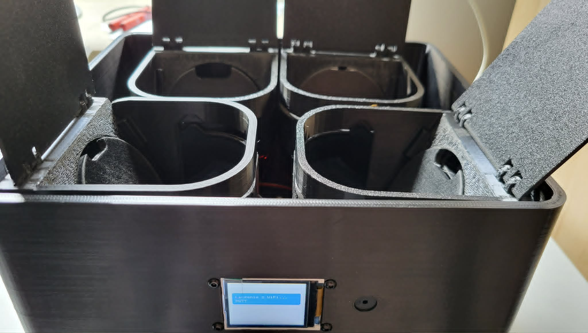
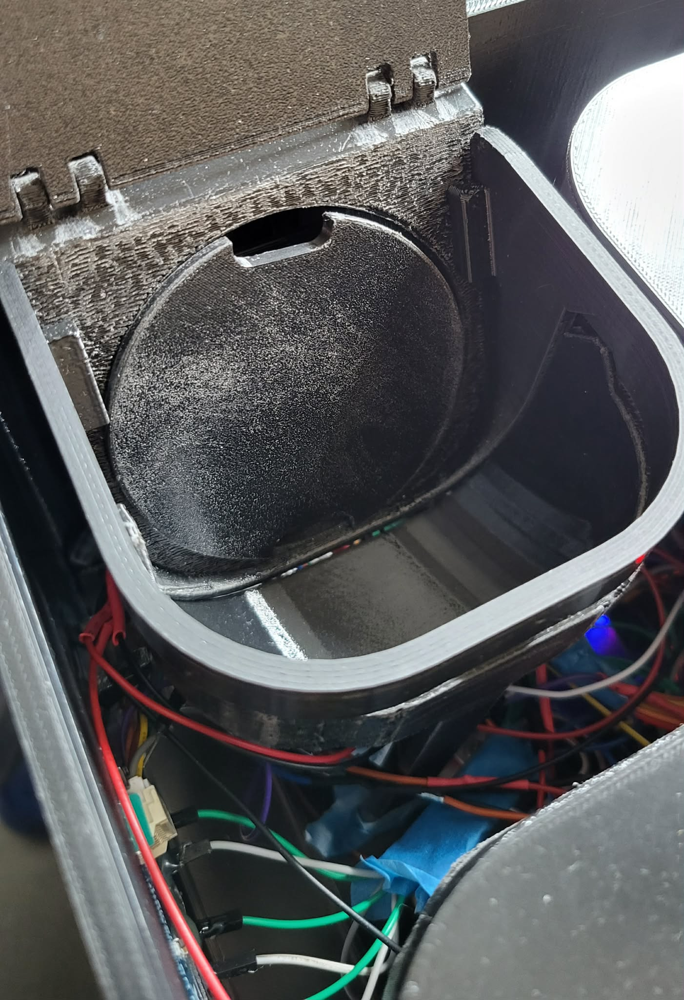

# SmartPillDispenser - hardware interface

##  Authors: Łukasz Chmielik, Wojciech Fiedoruk, Kamil Troszczyński

### Project description
The project will involve creating an intelligent dispenser for supplements or various types of medication. It will differ from existing designs in that it will be connected to a mobile application, where users can set a schedule for taking a given substance. The dispenser will also remind the user to take it at the scheduled time. This repository focuses on the implementation of the hardware layer for a smart dispenser designed for supplements or medications. It covers the integration and control of physical components such as the ESP32 microcontroller, servo motors, user input button and many others.

### 🚀 &nbsp;Some tools we would use

### Electronic diagram
[Electronic diagram](assets/electronic_diagram_first_version.png) is available here. 

### Final prototype

  
  

### Instruction how to setup it
- Install Platform.io in Visual Studio Code as extension
- Build environment 